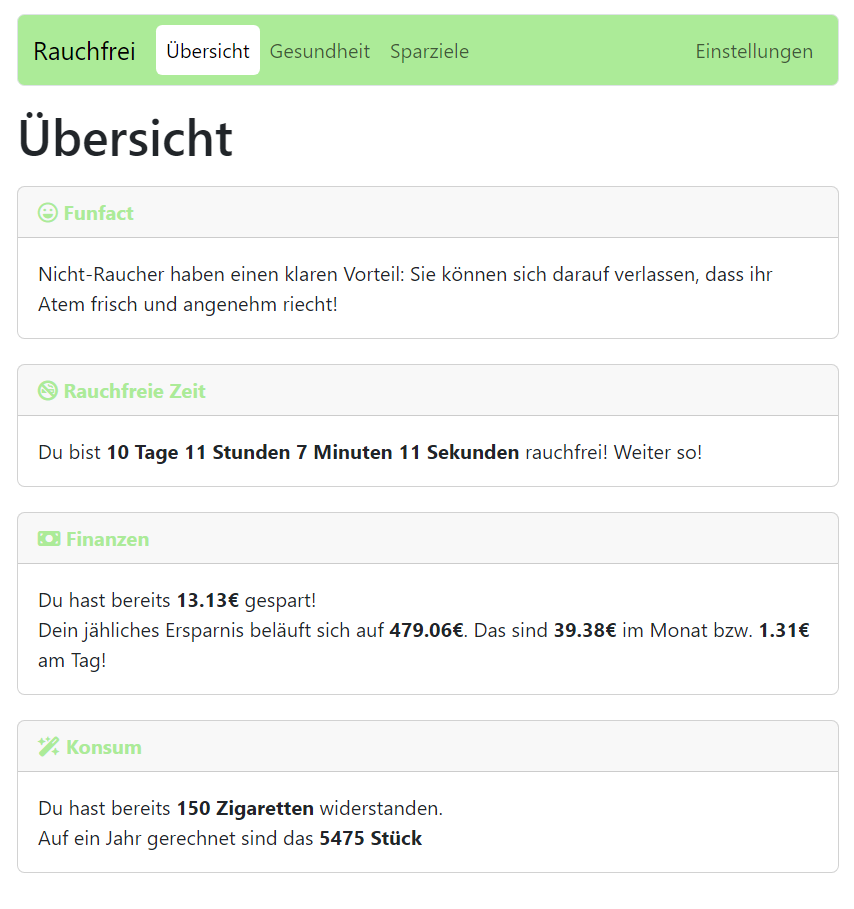
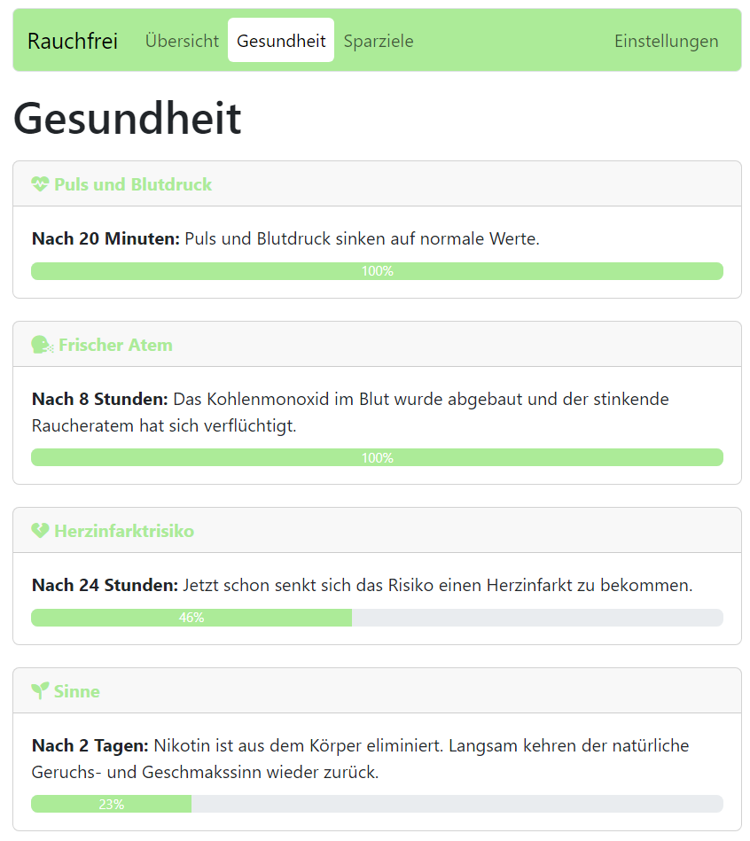
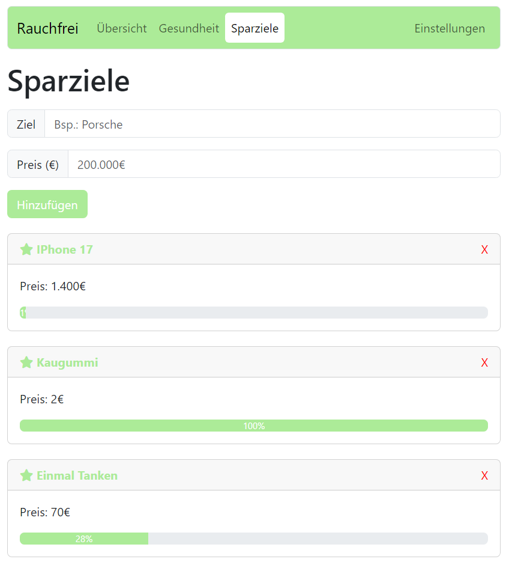

# Rauchfrei Astro Website

Willkommen auf der Rauchfrei Astro Website! Diese Website ist dazu da, Ihnen zu helfen, Ihren Weg zu einem rauchfreien Leben zu verfolgen und Ihre Fortschritte zu verfolgen. Durch die Rauchfreiheit können Sie nicht nur Ihre Gesundheit verbessern, sondern auch Geld sparen und ein erfüllteres Leben führen.

## Screenshots

### Fortschrittsübersicht

Diese Übersicht zeigt, wie lange Sie schon rauchfrei sind, wie viel Geld Sie gespart haben, wie viele Zigaretten Sie vermieden haben und den Gesundheitszustand.

### Gesundheit

Hier können Sie den fortschritt ihrer Genesung verfolgen und sehen wann Sie was errreichen werden.

### Sparziele

Sie können sich selber persönliche Sparziele erstellen und überblick über diese behalten.

## Features

- **Rauchfrei-Tage zählen:** Verfolgen Sie, wie lange Sie schon rauchfrei sind.
- **Geldsparrechner:** Sehen Sie, wie viel Geld Sie durch das Beenden des Rauchens gespart haben.
- **Zigaretten vermieden:** Erfahren Sie, wie viele Zigaretten Sie vermieden haben.
- **Gesundheitsverbesserung:** Erhalten Sie Informationen darüber, wie sich Ihre Gesundheit seit dem Rauchstopp verbessert hat.
- **Sparziele setzen:** Setzen Sie sich individuelle Sparziele und verfolgen Sie Ihren Fortschritt.
- **Neues Design:** Wir arbeiten an einem neuen Design, um Ihr Rauchfrei-Erlebnis zu verbessern.

## Todos

- Neues Design der Website für eine verbesserte Benutzererfahrung
- Firebase implementierung

Vielen Dank, dass Sie sich für einen rauchfreien Lebensstil entschieden haben. Wir hoffen, dass diese Website Ihnen auf Ihrem Weg zur Rauchfreiheit helfen kann!
